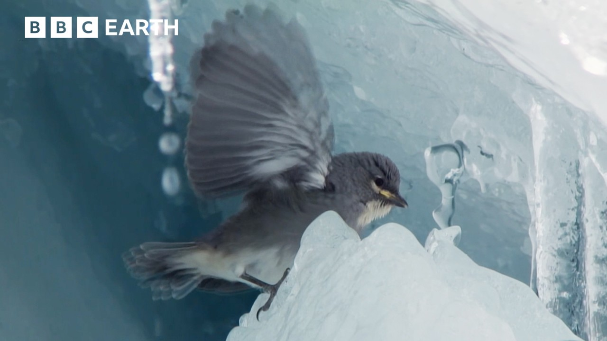

# Diuca: Glacier physics modelling with the MOOSE framework

diuca is a [MOOSE](https://mooseframework.inl.gov/) application to
simulate the viscous and elastic deformation of ice in various
conditions.

- [Why diuca?](#whydiuca)
- [Installation](#installation)

diuca currently includes:

- a new Full-Stokes model for viscous ice deformation tested with both Finite Elements (FE) and Finite Volumes (FV). It includes key elements for the modeling of tidewater glaciers such as an ocean boundary condition and a basal sliding law.

- setups for the simulation of elastic ice deformation so far applied to the study of glacier resonance through full response functions and impulse-response experiments.

## Why diuca?

To follow MOOSE convention of naming new applications with animal
names, diuca was named after the [White-winged Diuca Finch (Idiopsar
speculifer)](https://www.peruaves.org/thraupidae/white-winged-diuca-finch-diuca-speculifera/),
also known as glacier finch as it nests in ice cavities of glaciers
([Johnson,
1967](https://academic.oup.com/auk/article-abstract/85/3/524/5198113?redirectedFrom=fulltext),
[Hardy & Hardy,
2008](https://bioone.org/journals/The-Wilson-Journal-of-Ornithology/volume-120/issue-3/06-165.1/White-winged-Diuca-Finch-span-classgenus-speciesDiuca-speculifera-span-Nesting/10.1676/06-165.1.short),
[Lazo et al,
2025](https://papers.ssrn.com/sol3/papers.cfm?abstract_id=5366418)).

A recent [BBC Earth video](https://youtu.be/lTKsjZN-Aec) reveals for the
first time the life of a family of diuca finch at Quelccaya Glacier in
Peru.


## Installation

diuca requires a MOOSE installation. To install MOOSE, please follow
the steps described
[here](https://mooseframework.inl.gov/getting_started/installation/conda.html).

Once MOOSE is installed, diuca can be cloned locally:
```bash
git clone https://github.com/wehrad/diuca.git
```
Make sure to clone both MOOSE and diuca in the same `projects/` folder. This makes pointing at MOOSE from diuca easier.

Then, switch to the main branch:
```bash
cd diuca
git checkout main
```

Make sure your MOOSE conda environment is activated:
```bash
conda activate moose
```

Compile diuca (`-j` sets the number of cores to use for compilation):
```bash
make -j 4
```

And run the tests:
```bash
./run_tests -j 4
```

If the installation was successful, you should see that all tests
passing and some skipped. You can now use diuca to simulate glacier
physics!

To run diuca on a simple input file, use the newly-created executable:
```bash
./diuca-opt -i inputs/simple_input.i
```

In multiprocessing with `mpiexec`:
```bash
mpiexec -n 6 ./diuca-opt -i inputs/simple_input.i
```
